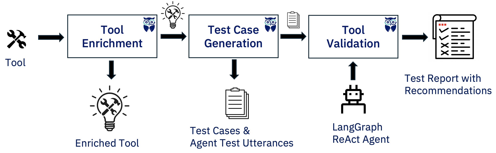

## Build-Time Stage

This stage occurs during building of tools and agents.

ALTK includes the following components for this stage:

1. [Tool Enrichment](../../altk/build_time/tool_enrichment_toolkit): Generate tool and parameter descriptions to enhance tool calling.
2. [Test Case Generation](../../altk/build_time/test_case_generation_toolkit): Generate user utterances to test agent behavior across a variety of scenarios.
3. [Tool Validation](../../altk/build_time/tool_validation_toolkit): Invoke the agent with test utterances and identify different types of tool-selection and argument-related errors.
