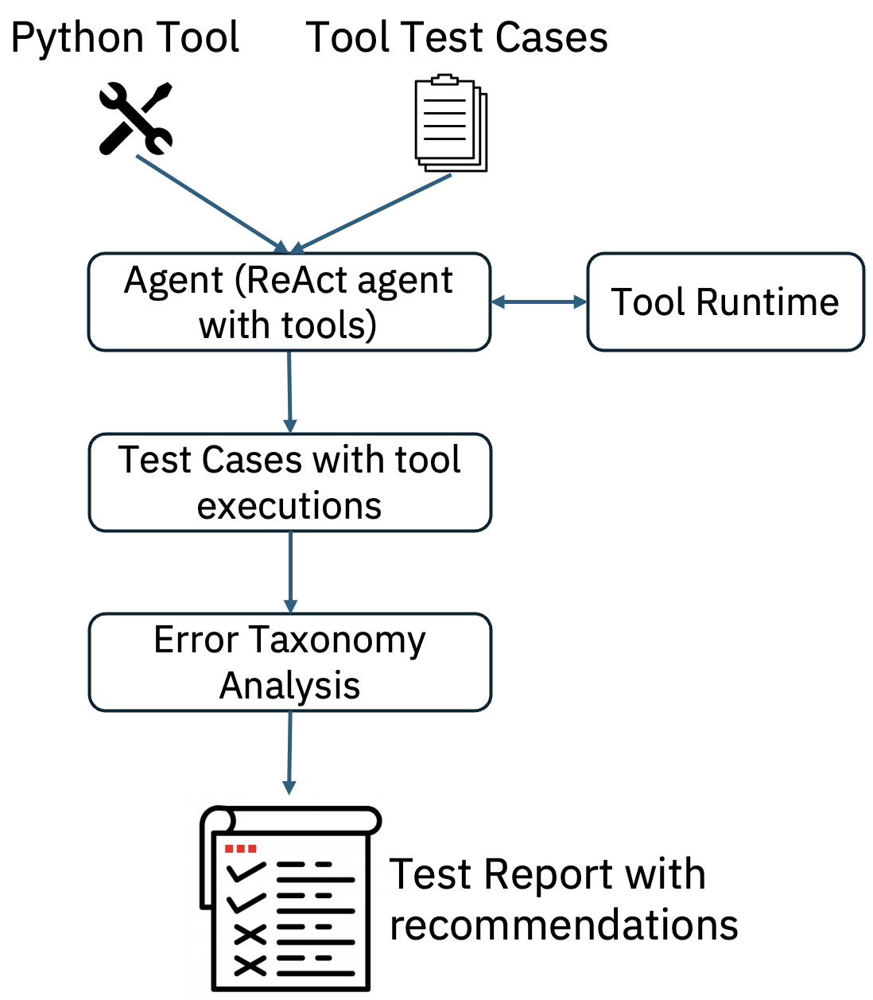
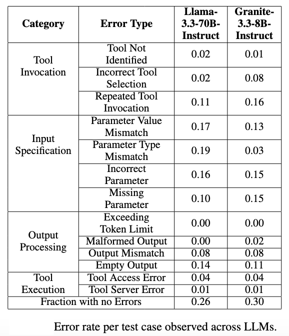

# Tool Validation Component

This component validates Python tools by running test cases with a ReAct agent bound to the required tools. After execution, the tool logs are analyzed to identify error types and provide corresponding recommendations.

## Features

This component performs tool validation and provide test report with the following error types and corresponding recommendations:

| error_type                                             | Recommendation                                                                                                                                                                                                                                   |
|--------------------------------------------------------|--------------------------------------------------------------------------------------------------------------------------------------------------------------------------------------------------------------------------------------------------|
| Incorrect tool identification                          | Agent identified incorrect tool - expected tool:<tool_name>,identified tool:<tool_name>  *** please modify or add the tool descriptions accordingly ***                                                                                          |
| Agent tool calling issue                               | Agent could not invoke tool calling for the identified tool - <tool_name> *** please check the tool definition ***                                                                                                                               |
| Agent tool calling issue - Incorrect Tool Input format | Agent could not invoke tool calling for the identified tool - <tool_name>  due to malformed tool input payload format , *** please modify the tool input processing code ***                                                                     |
| Incorrect tool input payload                           | Check tool input payload for : Missing or Incorrect parameters <parameters>  *** please modify tool input processing code accordingly,  provide parameter descriptions in the tool definition for the agent to correctly identify parameters *** |
| Incorrect tool inputs - Parameter Type Mismatch        | Check tool input parameter type mismatch for : <parameter, expected_param_type, tool_input_param_type> *** please modify the tool input processing code accordingly ***                                                                          |
| Incorrect tool inputs - Parameter Value Mismatch       | Check tool input parameter value mismatch for : <parameter, expected_param_value, tool_input_param_value> *** please provide parameter descriptions, examples in the tool definition, for the agent to correctly identify parameter values       |
| Agent Recursive Tool Calling                           | Agent invoked the tool repeatedly several times, tools invoked - <tool_name : tool_call_count> *** please modify the output returned in the tool definition accordingly, such that agent will not invoke the tool recursively ***                |
| Tool Output parsing error                              | Could not parse the tool output, *** please check output returned in tool definition ***                                                                                                                                                         |
| Tool Output exceeding LLM token limit                  | Agent LLM exceeding token limit, *** please try with a different LLM with large token limit ***                                                                                                                                                  |
| Incorrect tool autorization or access credentials      | please provide valid credentials for the tool                                                                                                                                                                                                    |
| Tool back-end server issue                             | Tool server is down, try after some time                                                                                                                                                                                                         |
| Issue with the inputs provided to the tool             | Tool input malformed, please provide tool inputs in correct format                                                                                                                                                                               |
| No results found in the tool output                    | Please provide relevant tool input values                                                                                                                                                                                                        |
 

## Architecture
The figure below shows the flow of tool validation.

## Benchmarking
Tool Validation is benchmarked on more than 180 tools related to enterprise applications with 2400 test cases. Following is the benchmarking results show that tool failures happen due to various errors and approximately 30 percent of test cases are passed with out any errors and only 36 percent of tools are working without any failures.

### Interface
This component expects the following input and generates the following output. 

#### Input
1. `python_tool_name` - tool that is used of validation.
2. `tool_test_cases` - multiple tool test cases used for testing the tool with an agent. 
3. `agent_with_tools` - We use langgraph type react agent bounded to the necessary tools to execute tool test cases.
#### Output
`test_report`: Tool test report with identified tool error taxonomy, recommendations for each test case (additionally tool execution logs can be added).

## Getting Started
Refer to this [README](https://github.com/AgentToolkit/agent-lifecycle-toolkit/blob/main/altk/build_time/tool_validation_toolkit/README.md) for instructions on how to get started with the code. 
See an example in action [here](https://github.com/AgentToolkit/agent-lifecycle-toolkit/blob/main/examples/tool_validation_single_tool_example.py).
